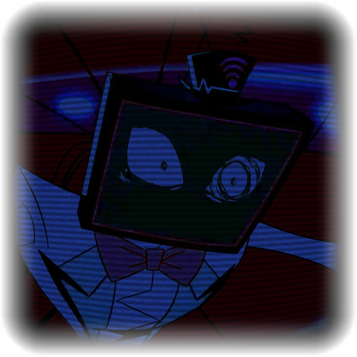

  <!-- 1️⃣ THE MEDIA OVERLORD GIF (original size) -->
  

  <!-- 2️⃣ VOX Profile Picture (bigger now) -->
   <!-- slightly bigger -->

     <!-- space before LaTeX text -->

  <!-- 3️⃣ Colorful LaTeX Header -->
 ${\textsf{\color{#192873}{Austin}\ .\color{#172469}\ {A}\color{#1a2873}{X}\color{#1f2f82}{E}\color{#24379c}{L}\ .\color{#24379c}\ {L}\color{#2b40ad}{u}\color{#3249bf}{c}\color{#3d57db}{i}~\color{#223fd4}{"\ ⟡\ \textbf{T\ H\ E\ .\ \ \ M\ E\ D\ I\ A\ .\ \ O\ V\ E\ R\ L\ O\ R\ D}\ \ ⟡\ "}\color{#192873}{....\ he\ '\ hym\ '\ it} }}$

${\textsf{\color{#192873}{c+h\ encouraged\ ...\ }\color{#223fd4}{RADIOSTATIC}\color{#192873}{\ \ and\ }\color{#223fd4}{RADIOAPPLE}\color{#192873}{\ INT\ .\ radiorose\ +\ voxval\ dni\ ...} }}$

${\textsf{\color{#4f66e0}{APPLEMEDIA\ }\color{#7185f0}{\{HEAVY}}\color{#4f66e0}{\ INT\ !!} }}$

${\textsf{\color{#192873}{-}}}$

${\textsf{\color{#192873}{Please\ sign\ the\ ata\ and\ check\ out\ my\ carrd\ :]} }}$
