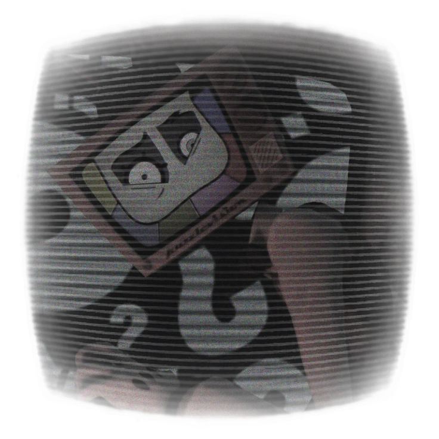

  <!-- 2️⃣ VOX Profile Picture (bigger now) -->
   <!-- slightly bigger -->

     <!-- space before LaTeX text -->

  <!-- 3️⃣ Colorful LaTeX Header -->
 ${\textsf{\color{#535961}{Puzzles}\ .\color{#606770}\ {A}\color{#6b737d}{X}\color{#79818c}{E}\color{#848d99}{L}\ .\color{#848d99}\ {L}\color{#8f98a6}{u}\color{#9ca6b5}{c}\color{#a9b4c4}{i}~\color{#b0bdd1}{"\ ⟡\ \textbf{P\ U\ Z\ Z\ L\ E\ .\ \ \ V\ I\ S\ I\ O\ N\}\ \ ⟡\ "}\color{#535961}{....\ he\ '\ hym\ '\ it} }}$

${\textsf{\color{#535961}{c+h\ encouraged\ ...\ }\color{#b0bdd1}{GUNSHOW}\color{#535961}{\ INT\ .\ basic\ criteria\ dni\ ...} }}$

${\textsf{\color{#c1cee3}{PLS\ SMG4\ FANS\ }\color{#ccd9f0}{\{HEAVY}}\color{#c1cee3}{\ INT\ !!} }}$

${\textsf{\color{#192873}{-}}}$

${\textsf{\color{#535961}{Please\ sign\ the\ ata\ and\ check\ out\ my\ carrd\ +\ strawpage\ :]} }}$
